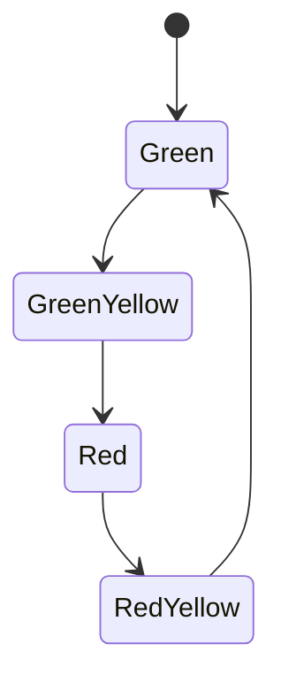

# Concept: Loops

## The `for` Loop

The `for` loop repeats a command *n* times.

### Example

The following loop runs 5 times:

```python
for i in range(5):
    print("I'm in a loop!")
```

Output:

```
I'm in a loop!
I'm in a loop!
I'm in a loop!
I'm in a loop!
I'm in a loop!
```

---

## The Loop Variable

You can use the variable `i` as a counter. It starts at 0 and increases:

```python
for i in range(5):
    print(i)
```

Output:

```
0
1
2
3
4
```

---

## General Form

```python
for i in range(max):
    <code block>
```

or

```python
for i in range(min, max):
    <code block>
```

This lets you loop a set number of times or through a specific range.

---

### Drawing with Loops

```python
import miniworlds 

world = miniworlds.World(200, 200)

for i in range(4):
    miniworlds.Circle((20 + 50 * i, 50), 20)

world.run()
```

This draws four circles in a row.

---

### Checkerboard Pattern

Use the modulo operator `%` to test if a number is even:
`x is divisible by 2 ⇨ x % 2 == 0`

```python
from miniworlds import *

world = World(200, 50)

for i in range(4):
    rect = Rectangle((50 * i, 0), 50, 50)
    if i % 2 == 0:
        rect.color = (255, 0, 0, 255)
    else:
        rect.color = (255, 255, 255, 255)

world.run()
```

---

### Graphs

```python
from miniworlds import *

world = World(400, 400)

for x in range(400):
    gl = 0.5 * x + 50
    y = 400 - gl
    Point((x, y))

world.run()
```

---

### Nested Loops

You can use nested loops to draw 2D patterns:

```python
from miniworlds import *

world = World(200, 200)

for i in range(4):
    for j in range(4):
        Circle((20 + 50 * i, 20 + 50 * j), 20)

world.run()
```

---

## The `while` Loop

General syntax:

```python
while <condition>:
    <code block>
```

As long as the condition is `True`, the loop repeats. Be careful — this can create infinite loops.

### Example: Random Pattern

```python
from miniworlds import *
import random

world = World(255, 60)
x = 0

while x < 255:
    c = Circle((x, 30), 20)
    c.color = (x, 0, 0, random.randint(0, 255))
    x = x + random.randint(10, 50)

world.run()
```

---

## The Main Loop

Your program essentially runs inside a loop like this:

```python
while <no quit>:
    <draw screen>
    <handle events>
```

A `for` loop is not suitable for this because you must know in advance how many iterations there will be.

---

## Loops Inside Registered Methods

If you use loops inside `act()` or an event method, you should know:

**The entire loop runs within a single frame!**
That means it’s not suitable for animation — which depends on changes from frame to frame.

---

### Example: Traffic Light State Machine

A simple state diagram:



---

#### Incorrect Approach: `while` loop (runs instantly)

```python
from miniworlds import *

state = "green"

while True:
    if state == "green":
        state = "green-yellow"
        print("green")
    elif state == "green-yellow":
        state = "red"
        print("green-yellow")
    elif state == "red":
        state = "red-yellow"
        print("red")
    elif state == "red-yellow":
        state = "green"
        print("red-yellow")

world.run()
```

---

#### Correct Approach: Use `act()` instead

```python
from miniworlds import *

world = World(100, 240)
state = "green"
g = Circle((50, 40), 40)
y = Circle((50, 120), 40)
r = Circle((50, 200), 40)

@world.register
def act(self):
    global state
    if world.frame % 20 == 0:
        if state == "green":
            g.color = (0, 255, 0)
            y.color = (255, 255, 255)
            r.color = (255, 255, 255)
            state = "green-yellow"
            print("green")
        elif state == "green-yellow":
            g.color = (0, 255, 0)
            y.color = (255, 255, 0)
            r.color = (255, 255, 255)
            state = "red"
            print("green-yellow")
        elif state == "red":
            g.color = (255, 255, 255)
            y.color = (255, 255, 255)
            r.color = (255, 0, 0)
            state = "red-yellow"
            print("red")
        elif state == "red-yellow":
            g.color = (255, 255, 255)
            y.color = (255, 255, 0)
            r.color = (255, 0, 0)
            state = "green"
            print("red-yellow")

world.run()
```

The program flow is the same, but the infinite loop is replaced by the `act()` method, which runs frame by frame.
