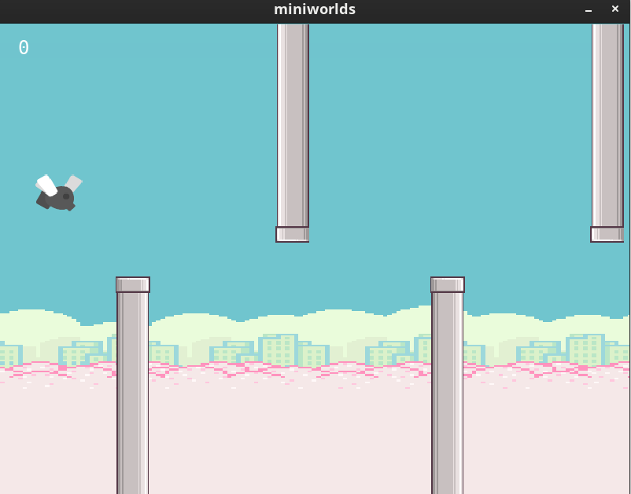

# Tutorial: Flappy Bird

In diesem Kapitel erstellen wir Schritt für Schritt ein Flappy Bird-Spiel unter Verwendung der `miniworlds_physics` Engine.



---

## Schritt 1: Importieren der Physik-Engine

Installiere das Paket `miniworlds_physics` genauso, wie du `miniworlds` installiert hast. Danach importierst du die `PhysicsWorld`:

```python
import random
from miniworlds import Actor, Number, Text
from miniworlds_physics import PhysicsWorld  # Import der Physik-Engine

world = PhysicsWorld(800, 600)
# Dein Code kommt hier hin
world.run()
```

---

## Schritt 2: Röhren (Pipes) erstellen

### Röhren hinzufügen und in einer Liste speichern

Füge mehrere Röhren (Pipes) hinzu und speichere sie in einer Liste, um später ihre Eigenschaften leichter ändern zu können:

```python
pipes = [
    Actor(position=(300, world.height - 280)),
    Actor(position=(500, 0)),
    Actor(position=(700, world.height - 280)),
    Actor(position=(900, 0))
]
```

#### Erklärung:

* Es werden vier Röhren erstellt, die in der Liste `pipes[]` gespeichert werden.

### Eigenschaften der Röhren festlegen

Verwende eine Schleife, um Eigenschaften für alle Röhren festzulegen:

```python
for pipe in pipes:
    pipe.direction = 0
    pipe.add_costume("images/pipe1.png")
    pipe.size = (50, 280)
    pipe.passed = False
    pipe.physics.simulation = "manual"  # Manuelle Steuerung
    pipe.physics.velocity_x = -150  # Geschwindigkeit der Pipes
    pipe.origin = "topleft"  # Oben links als Referenzpunkt
```

Für die 2. und 4. Röhre (die von oben nach unten zeigen) wird die Orientierung um 180 Grad gedreht:

```python
pipes[1].costume.orientation = -180
pipes[3].costume.orientation = -180
```

#### Erklärung:
* **pipe.physics.simulation**: Mit `manual` wird festgelegt, dass die Schwerkraft keine Wirkung auf die Röhre hat.
* **pipe.physics.velocity_x**: Die Bewegung erfolgt durch Ändern der Geschwindigkeit.
* **pipe.origin**: Der Referenzpunkt ist die obere linke Ecke der Röhre, was das Verschieben vereinfacht.

### Methoden für die Röhren registrieren

Nun fügen wir den Röhren zwei wichtige Methoden hinzu:

```python
for pipe in pipes:
    @pipe.register
    def act(self):
        if self.x < 75 and not self.passed:
            self.passed = True

    @pipe.register
    def on_detecting_left_border(self):
        self.move_to((self.x + random.randint(750, 800), self.y))
        self.passed = False
```

#### Erklärung:
* **act**: Diese Methode prüft, ob die Röhre vom Spieler überquert wurde.
* **on_detecting_left_border**: Wenn die Röhre den linken Bildschirmrand erreicht, wird sie an eine zufällige Position rechts verschoben.

---

## Schritt 3: Den Vogel (Bird) erstellen

### Attribute festlegen

Der Vogel wird als `Actor` erstellt und seine Attribute festgelegt:

```python
bird = Actor()
bird.position = (75, 200)
bird.add_costume("images/fly.png")
bird.size = (60, 60)
bird.physics.simulation = "simulated"
bird.is_flipped = True
bird.physics.size = (0.8, 0.8)
bird.physics.shape_type = "circle"
bird.is_rotatable = False
```

#### Erklärung:
* **bird.physics.simulation**: Der Vogel wird durch die Schwerkraft beeinflusst.
* **bird.physics.size**: Ein kleinerer Kollisionsbereich macht das Spiel etwas einfacher.

### Methoden für den Vogel registrieren

#### Erkennen des Spielfeldrands

Wenn der Vogel den Bildschirm verlässt, endet das Spiel mit einer "Game Over"-Nachricht:

```python
@bird.register
def on_detecting_borders(self, borders):
    if "bottom" in borders or "top" in borders:
        end = Text("Game over!", position=(400, 200))
        world.game_over = True
        world.stop()
```

#### Erkennen von Kollisionen mit Röhren

Berührt der Vogel eine Röhre, endet ebenfalls das Spiel:

```python
@bird.register
def on_detecting_actor(self, other):
    if other in pipes:
        end = Text("Game over!", position=(200, 200))
        world.game_over = True
        world.stop()
```

#### Erkennen von Benutzereingaben

Wenn die Leertaste gedrückt wird, bewegt sich der Vogel nach oben:

```python
@bird.register
def on_key_down_space(self):
    self.physics.velocity_y = -200
    if not world.is_running and not world.game_over:
        world.start()
```

---

## Schritt 4: Punktestand hinzufügen

Die Punktanzeige wird statisch festgelegt, damit sie nicht von der Physik beeinflusst wird:

```python
score = Number()
score.position = (30, 30)
score.size = (40, 40)
score.physics.simulation = "static"
```

In der `act`-Methode der Röhren wird der Punktestand jedes Mal erhöht, wenn der Spieler eine Röhre überquert:

```python
@pipe.register
def act(self):
    if self.x < 75 and not self.passed:
        self.passed = True
        score.inc()
```

---

## Kompletter Code

```python
import random
from miniworlds import Actor, Number, Text
from miniworlds_physics import PhysicsWorld

world = PhysicsWorld(800, 600)
world.game_over = False
world.add_background("images/background.png")

pipes = [
    Actor(position=(300, world.height - 280)),
    Actor(position=(500, 0)),
    Actor(position=(700, world.height - 280)),
    Actor(position=(900, 0))
]

for pipe in pipes:
    pipe.add_costume("images/pipe1.png")
    pipe.size = (50, 280)
    pipe.passed = False
    pipe.physics.simulation = "manual"
    pipe.physics.velocity_x = -150
    pipe.origin = "topleft"

    @pipe.register
    def act(self):
        if self.x < 75 and not self.passed:
            self.passed = True
            score.inc()

    @pipe.register
    def on_detecting_left_border(self):
        self.move_to((self.x + random.randint(750, 800), self.y))
        self.passed = False

pipes[1].costume.orientation = -180
pipes[3].costume.orientation = -180

score = Number()
score.position = (30, 30)
score.size = (40, 40)
score.physics.simulation = "static"

bird = Actor()
bird.position = (75, 200)
bird.add_costume("images/fly.png")
bird.size = (60, 60)
bird.physics.simulation = "simulated"
bird.is_flipped = True
bird.physics.size = (0.8, 0.8)
bird.is_rotatable = False

@bird.register
def on_detecting_borders(self, borders):
    if "bottom" in borders or "top" in borders:
        end = Text("Game over!", position=(400, 200))
        world.game_over = True
        world.stop()

@bird.register
def on_detecting_actor(self, other):
    if other in pipes:
        end = Text("Game over!", position=(200, 200))
        world.game_over = True
        world.stop()

@bird.register
def on_key_down_space(self):
    self.physics.velocity_y = -200
    if not world.is_running and not world.game_over:
        world.start()

world.run()
```