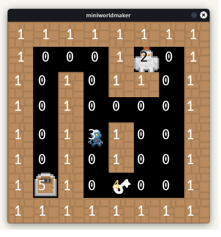

# Tutorial: Labyrinth-Spiel

In diesem Kapitel erstellen wir Schritt für Schritt gemeinsam ein Labyrinth-Spiel.



Die Technik, eine Kachelkarte (Tilemap) zu erstellen, ist in vielen Spielen gängig. Nachdem du es hier gelernt hast, wirst du in der Lage sein, diese Technik in deine eigenen Projekte zu integrieren.

* **Basierend auf**: `https://github.com/electronstudio/pygame-zero-book`
* **Lizenz:** Attribution-NonCommercial-ShareAlike 4.0 International

## Schritt 1: Schauspieler aus einer Kachelkarte laden

Eine Kachelkarte verwendet eine kleine Anzahl von Bildern (Kacheln), die mehrmals gezeichnet werden, um ein großes Spiellevel (die Karte) zu erstellen. Dies spart Arbeit beim Erstellen vieler Grafiken und erleichtert Änderungen am Level-Design. In diesem Beispiel erstellen wir ein Labyrinth-Level.

Wir benötigen drei Bilddateien: `player.png`, `wall.png`. Diese müssen im Ordner `mu_code/images` gespeichert werden.

```
my_code
|
|--images
|----player.png
|----wall.png
```

Jetzt können wir den Rahmen für unser Spiel programmieren:

### Eine Welt erstellen

Verwende dieses Grundgerüst für dein Spiel:

In Zeile 2 wird eine `TiledWorld` erstellt, die die Logik für gekachelte Welten bereitstellt. In der letzten Zeile musst du unbedingt `world.run()` aufrufen, um das Spiel zu starten.

``` python
from miniworlds import * 
world = TiledWorld(8, 8)
world.tile_size = 64
world.add_background((0, 0, 0, 255))

# Dein Code hier

world.run()
```

### Schauspieler-Unterklassen erstellen

Erstelle Schauspieler-Unterklassen für jeden **Typ** von Schauspieler:

```python
class Player(Actor):
    def on_setup(self):
        self.add_costume("player")
        self.layer = 1
        
class Wall(Actor):
    def on_setup(self):
        self.add_costume("wall")
```

`self.add_costume` fügt dem Schauspieler ein Kostüm hinzu, das auf einem Bild basiert (z. B. "player", "wall" – Dateiendungen wie `.png` oder `.jpeg` können weggelassen werden) oder auf einer Farbe, die als (r, g, b, a)-Tupel angegeben wird.

### Eine Kachelkarte erstellen

Eine Kachelkarte ist eine 2D-Liste, die die Positionen der Schauspieler bestimmt.

- 0: Leer
- 1: Wand
- 2: Spieler

``` python
tiles = [None, Wall, Player]

maze = [
    [1, 1, 1, 1, 1, 1, 1, 1],
    [1, 0, 0, 0, 1, 2, 0, 1],
    [1, 0, 1, 0, 1, 1, 0, 1],
    [1, 0, 1, 0, 0, 0, 0, 1],
    [1, 0, 1, 0, 1, 0, 0, 1],
    [1, 0, 1, 0, 1, 0, 0, 1],
    [1, 0, 1, 0, 0, 0, 0, 1],
    [1, 1, 1, 1, 1, 1, 1, 1]
]
```

### Objekte für jede Zelle der Kachelkarte erstellen

Für jede Zelle der Kachelkarte kann ein Schauspieler erzeugt werden. Die Klasse für jeden Schauspieler wird aus der Kachelkarte abgerufen.

```python
@world.register
def on_setup(self):
    for row in range(len(maze)):
        for column in range(len(maze[row])):
            actor_cls = tiles[maze[row][column]]
            if actor_cls:
                actor_cls(column, row)
```

## Schritt 2: Bewegung

### Spieler bewegen

Füge folgenden Code zur `Player`-Klasse hinzu, um den Spieler zu bewegen:

```python
class Player(Actor):
    def on_setup(self):
        self.add_costume("player")
        self.layer = 1

    def on_key_down(self, keys):
        if "UP" in keys:
            self.y -= 1
        elif "DOWN" in keys:
            self.y += 1
        elif "LEFT" in keys:
            self.x -= 1
        elif "RIGHT" in keys:
            self.x += 1
```

### Bewegung blockieren

Verwende die Methode `move_back()`, um die Bewegung des Spielers zu blockieren, wenn er auf eine Wand trifft:

```python
def on_key_down(self, keys):
    if "UP" in keys:
        self.y -= 1
    elif "DOWN" in keys:
        self.y += 1
    elif "LEFT" in keys:
        self.x -= 1
    elif "RIGHT" in keys:
        self.x += 1
    if self.detect_actor(Wall):
        self.move_back()
```

## Einen Gegner erstellen

Erstelle eine Gegner-Klasse, die den Spieler jagt:

```python
class Enemy(Actor):
    def on_setup(self):
        self.add_costume("enemy")
        self.velocity = 1
        self.layer = 1

    def act(self):
        self.y += self.velocity
        if self.detect_actor(Wall):
            self.move_back()
            self.velocity = -self.velocity
        if self.detect_actor(Player):
            print("Du wurdest gefangen!")
            exit()
```

### Zusammenfassung

In diesem Tutorial hast du ein einfaches Labyrinth-Spiel mit beweglichen Schauspielern und Kachelkarten erstellt. Mit dieser Grundlage kannst du weitere Funktionen wie Punkte, Levelaufstiege oder komplexere Gegner hinzufügen!