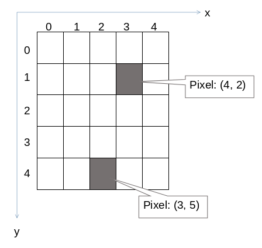

# Drawing with Miniworlds – Basics

## Foreword

This tutorial is heavily inspired by the fantastic lecture notes by Prof. Dr. Michael Kipp: [https://michaelkipp.de/processing/](https://michaelkipp.de/processing/), which are based on Processing.

The Miniworlds version of Processing borrows several ideas and concepts but implements them in slightly different ways.
In this tutorial, you’ll learn programming with Miniworlds using its *Processing mode*, which is modeled after the popular visual programming environment.

---

## How Does Drawing Work on a Computer?

Monitors consist of a grid of tiny squares. These are so small they appear as points to us. These tiny squares are called *pixels*.

Pixels are arranged in a *coordinate system*, which usually starts in the **top-left corner**:



```{note}
Computer scientists usually start counting at 0.  
That means the top-left corner is (0, 0), and if the screen is 800×600 pixels, the bottom-right corner is (799, 599).
```

---

## The First Program

A Miniworlds program typically consists of the following parts:

```python
from miniworlds import *
world = World()

# Your code here

world.run()
```

* **Line 1**: Imports the Miniworlds library
* **Line 2**: Creates the game world
* **Last line**: Starts the main loop with `world.run()` – this must always be the final line of your program

Everything in between can be your own code or comments.
Comments start with `#` and are ignored by the computer. They are written for **humans** to help understand the code.

Example:

```python
from miniworlds import *

world = World()

Point((10, 10))

world.run()
```


You can also set the window size by passing width and height to `World`:

```python
from miniworlds import *

world = World(200, 400)
world.run()
```

---

## Drawing Basic Shapes

### Lines

Syntax:

```python
Line(startpoint, endpoint)
```

Both `startpoint` and `endpoint` are tuples, e.g., `(1, 2)`.

Draw a line from (10, 10) to (100, 200):

```python
from miniworlds import *

world = World()
Line((10, 10), (100, 200))
world.run()
```


---

### Circles

```python
Circle(position, radius)
```

```{note}
The position refers to the **center** of the circle.
```

Example:

```python
from miniworlds import *

world = World()
Circle((100, 200), 20)
world.run()
```


---

### Rectangles

```python
Rectangle(position, width, height)
```

* `position` is the **center** corner of the rectangle

Example:

```python
from miniworlds import *

world = World()
Rectangle((100, 100), 20, 100)
world.run()
```


It is often easier to draw a rectangle starting from the top-left position. You can do this with the method `from_center`:

```
Rectangle.from_center((100, 100), 20, 100)
```

---

### Ellipses

```python
Ellipse(position, width, height)
```

Like rectangles, but the shape is oval and fits inside the given rectangle.

Example:

```python
from miniworlds import *

world = World()
Ellipse((100, 100), 20, 100)
world.run()
```


---

### Centered Rectangles and Ellipses

#### 1. `from_center`

Use `.from_center()` to draw an ellipse centered on a point:

```python
from miniworlds import *

world = World()
Ellipse.from_center((50, 100), 100, 200)
world.run()
```


#### 2. Using `.center`

You can manually center an ellipse like this:

```python
from miniworlds import *

world = World()
ellipse = Ellipse((0, 0), 100, 200)
ellipse.center = (50, 100)
world.run()
```

---

## More Complex Shapes

### Arcs

```python
Arc(position, width, height, start_angle, end_angle)
```

* `position`: center of bounding box
* `width` and `height`: ellipse size
* `start_angle`, `end_angle`: angles in degrees, counterclockwise from the right


Example:

```python
from miniworlds import *

world = World()
Arc.from_center((200, 200), 200, 200, 30, 242)
world.run()
```

---

### Triangle

```python
Triangle(p1, p2, p3)
```

Each point is a tuple like `(x, y)`.

Example:

```python
from miniworlds import *

world = World()
Triangle((10, 10), (100, 100), (200, 10))
world.run()
```

---

### Polygon

```python
Polygon(pointlist)
```

`pointlist` is a list of tuples.
For example, a triangle as a polygon:

```python
from miniworlds import *

world = World()
Polygon([(10, 10), (100, 100), (200, 10)])
world.run()
```

---

## 🧠 Training Exercises

### Exercise 1.1 – House with Shapes

Draw a house using basic shapes:


<details>
<summary><strong>Solution hint</strong></summary>

```python
from miniworlds import *

world = World()
world.size = (120, 210)
Rectangle((10, 100), 100, 100)
Triangle((10, 100), (60, 50), (110, 100))

world.run()
```

</details>

---

### Exercise 1.2 – Face

Draw a face using basic shapes:


<details>
<summary><strong>Solution hint</strong></summary>

```python
from miniworlds import *
import random

world = World()
world.size = (100, 100)

Circle.from_center((50, 50), 50)
Arc.from_center((50, 80), 40, 20, 180, 360)
Circle.from_center((30, 30), 10)
Circle.from_center((70, 30), 10)
Line((50, 50), (50, 70))

world.run()
```

</details>
