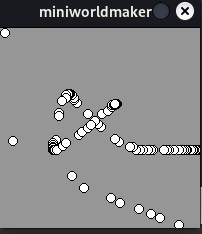
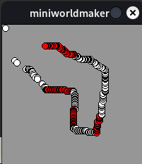
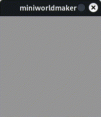

# Interaction

## `on_setup` and `act`

Until now, you've written commands sequentially, and they were executed from top to bottom.

If you want to write an interactive program, you'll need to break away from that pattern.

You can **register** methods that are called at certain times or in response to specific events.

We’ll start with two simple methods: `on_setup` and `act`:

* `on_setup` is called **once** when the `World` is created.
* `act` is called **continuously**, once per time unit (or frame).

The following program:

```python
from miniworlds import *

world = World()
world.size = (120, 210)

@world.register
def on_setup(self):
    print("setup")

@world.register
def act(self):
    print("act")
```

Produces the output:

```
setup
act
act
act
```

---

## Code Blocks

The line `def on_setup(self):` ends with a colon. Below it is a **code block**.

The contents of the function are **indented**. Everything with the same indentation belongs to the same block.

```python
from miniworlds import *

world = World()
world.size = (120, 210)

@world.register
def on_setup(self):
    print("This ")
    print("is ")
    print("part ")
    print("of a code block")
print("But this is not")
```

When `on_setup` is called, only the indented four lines are executed—not the last one.

> **Note**: In Python, it's standard to use **4 spaces** for indentation.
> Technically, any consistent indentation (2, 3, 5 spaces or tabs) is valid, but using 4 spaces is considered good style.

---

## Frame Rate – How Often Is `act()` Called?

You can configure how often `act()` is called using the `world.fps` and `world.speed` attributes:

* `world.fps` sets the **frame rate** (frames per second). Like a flipbook, this defines how often the screen is redrawn.
  Default is 60 frames per second.

* `world.frame` stores the current frame number. It counts upward from the start.

* `world.speed` defines how often `act()` is called per second. A value of 60 means `act()` is called once every 60 frames.

```python
from miniworlds import *

world = World()
world.size = (120, 210)

@world.register
def on_setup(self):
    world.fps = 1
    world.speed = 3

@world.register
def act(self):
    print(world.frame)

world.run()
```

This will produce:

```
3
6
9
12
15
```

Because only **1 frame per second** is rendered, and `act()` is triggered every 3rd frame—so every 3 seconds.

---

## ⚠️ Warning: Incorrect Indentation

Be careful with indentation, as incorrect placement can lead to unexpected behavior.

Example:

```python
from miniworlds import *

world = World()
world.size = (120, 210)

@world.register
def on_setup(self):
    print(1)

print(2)

@world.register
def act(self):
    print(3)
print(4)

world.run()
```

Output:

```
1
2
4
1
3
3
```

Explanation:

* `on_setup()` is called immediately after creating the `World`.
* Then the two unindented `print()` statements are run.
* Finally, after `run()` is started, `act()` is triggered repeatedly.

Make sure your statements are inside the correct code blocks.

---

## Mouse Interactions

In **miniworlds**, interactions occur via **events**, such as keyboard and mouse input.

You can use `get_mouse_position()` to retrieve the current mouse position:

```python
from miniworlds import *

world = World()

@world.register
def on_setup(self):
    world.size = (200, 200)

@world.register
def act(self):
    Ellipse(world.get_mouse_position(), 10, 10)

world.run()
```

This draws a circle that follows the mouse:



To draw lines, you need the current and previous mouse position:

```python
from miniworlds import *

world = World()

@world.register
def on_setup(self):
    world.size = (200, 200)

@world.register
def act(self):
    Line(world.get_prev_mouse_position(), world.get_mouse_position())

world.run()
```


---

## Listener Methods

You can respond to specific events like mouse clicks by registering **listener methods**, e.g., `on_mouse_left`:

```python
from miniworlds import *

world = World()

@world.register
def on_setup(self):
    world.size = (200, 200)

@world.register
def act(self):
    Ellipse(world.get_mouse_position(), 10, 10)

@world.register
def on_mouse_left(self, position):
    world.fill_color = (255, 0, 0)

@world.register
def on_mouse_right(self, position):
    world.fill_color = (255, 255, 255)

world.run()
```



---

## Keyboard Input

You can also respond to keyboard input:

```python
from miniworlds import *

world = World()

@world.register
def on_setup(self):
    world.size = (200, 200)

@world.register
def on_key_down_a(self):
    a = Ellipse.from_center((100, 100), 100, 100)
    a.fill_color = (255, 0, 0)

@world.register
def on_key_down_b(self):
    a = Ellipse.from_center((100, 100), 100, 100)
    a.fill_color = (0, 255, 0)

world.run()
```

This program responds to pressing **A** or **B**:

* <kbd>a</kbd>: red ellipse
* <kbd>b</kbd>: green ellipse

---

### Using Randomness

Python's `random` library lets you create interesting visual effects.

For example, this creates a circle with a random color:

```python
from miniworlds import *
import random

world = World()

@world.register
def on_setup(self):
    world.size = (200, 200)

@world.register
def on_key_down_a(self):
    a = Ellipse.from_center((100, 100), 100, 100)
    a.fill_color = (
        random.randint(0, 255),
        random.randint(0, 255),
        random.randint(0, 255)
    )

world.run()
```

Output:


