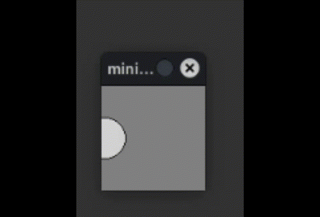
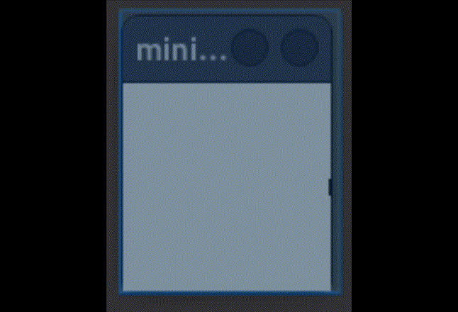

# Movement

In this chapter, we’ll set elements in motion — with the help of variables.

---

## Simple Movement

You can create a simple movement by changing the `x` and `y` attributes of an object:

```python
from miniworlds import *
import random
world = World(100, 100)

c = Circle((0, 50), 20)

@world.register
def act(self):
    c.x = c.x + 1

world.run()
```

**Output:**



---

## The Modulo Operator

The **modulo operator** is especially helpful for creating repeating movements.

Python supports three types of division:

* `13 / 3` gives the result `4.3333…`
* `13 // 3` gives the **integer** result `4`
* `13 % 3` returns the **remainder** of the division, in this case `1`

Since the remainder is never greater than the divisor, we can use it for looping animations:

```python
from miniworlds import *
import random
world = World(100, 100)

c = Circle((0, 50), 20)
x = 0

@world.register
def act(self):
    global x
    c.x = x % 100
    x = x + 1

world.run()
```

The variable `x` keeps increasing, but `x % 100` always returns a number between 0 and 99.
This makes the circle loop back after reaching the edge.

**Output:**


