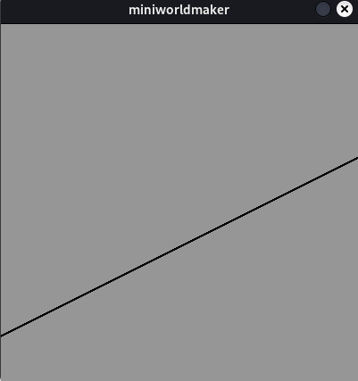
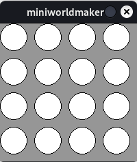
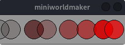
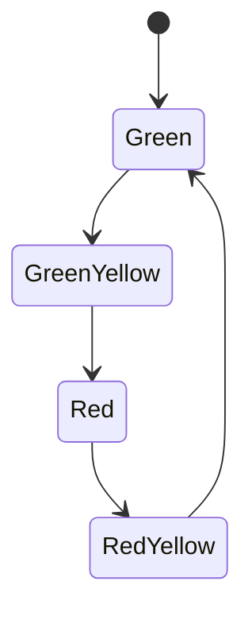

# Loops

## The for Loop

The `for` loop – simply put – repeats a command `n` times:

### Example

The following loop runs 5 times:

```python
for i in range(5):
    print("I'm in a loop!")
```

This program produces the output:

```
I'm in a loop!
I'm in a loop!
I'm in a loop!
I'm in a loop!
I'm in a loop!
```

## The Counter Variable

You can use the variable `i` as a counter. It increases (starting at 0):

### Example

```python
for i in range(5):
    print(i)
```

This program prints:

```
0
1
2
3
4
```

## General Form

Generally, you write:

```python
for i in range(max):
    <code block>
```

or

```python
for i in range(min, max):
    <code block>
```

You can specify how many times the loop runs or define a specific range.

### Examples: Drawing with Loops

You can use loops to draw:

```python
from miniworlds import *

world = World(200, 200)

for i in range(4):
    Circle((20 + 50 * i, 50), 20)

world.run()
```


### Checkerboard Pattern

Using the modulo operator, you can check if a number is divisible by 2:
`x is divisible by 2 if x % 2 == 0`.

This can be used to create checkerboard-like patterns by combining loops with `if` statements:

```python
from miniworlds import *

world = World(200, 50)

for i in range(4):
    rect = Rectangle((50 * i, 0), 50, 50)
    if i % 2 == 0:
        rect.color = (255, 0, 0, 255)
    else:
        rect.color = (255, 255, 255, 255)

world.run()
```


### Graphs

You can also draw graphs this way:

```python
from miniworlds import *

world = World(400, 400)

for x in range(400):
    gl = 0.5 * x + 50
    y = 400 - gl
    Point((x, y))

world.run()
```



### Nested Loops

Using nested loops, you can draw multi-dimensional patterns:

```python
from miniworlds import *

world = World(200, 200)

for i in range(4):
    for j in range(4):
        Circle((20 + 50 * i, 20 + 50 * j), 20)

world.run()
```



---

## The while Loop

The `while` loop has the following structure:

```python
while <condition>:
    <code block>
```

* As long as the condition is true, the loop repeats. This allows for infinite loops if the condition is never false.

### Example

The following program generates a random pattern:

```python
from miniworlds import *
import random

world = World(255, 60)
x = 0

while x < 255:
    c = Circle((x, 30), 20)
    c.color = (x, 0, 0, random.randint(0, 255))
    x = x + random.randint(10, 50)

world.run()
```



---

## The Main Loop

Your entire program technically runs inside a `while` loop:

```python
while <no quit>:
  <draw images on screen>
  <handle logic and events>
```

The `for` loop is not suited for this since you need to know ahead of time how many iterations will occur.

---

## Loops Inside Registered Methods

If you want to use a loop inside an `act` method or an event handler, keep in mind:

The entire loop is executed within **one frame**. This means loops are not suitable for controlling animations across frames (like moving a figure frame by frame). Instead, `act()` is called once per frame.

### Example: Traffic Light

A traffic light system can be modeled as a **state diagram**:



Translated to code with a `while` loop:

```python
from miniworlds import *

state = "green"

while True:
    if state == "green":
        state = "green-yellow"
        print("green")
    elif state == "green-yellow":
        state = "red"
        print("green-yellow")
    elif state == "red":
        state = "red-yellow"
        print("red")
    elif state == "red-yellow":
        state = "green"
        print("red-yellow")

world.run()
```

In a miniworlds program, this becomes part of the `act()` method:

```python
from miniworlds import *

world = World(100, 240)
state = "green"
g = Circle((50, 40), 40)
y = Circle((50, 120), 40)
r = Circle((50, 200), 40)

@world.register
def act(self):
    global state
    if world.frame % 20 == 0:
        if state == "green":
            g.color = (0, 255, 0)
            y.color = (255, 255, 255)
            r.color = (255, 255, 255)
            state = "green-yellow"
            print("green")
        elif state == "green-yellow":
            g.color = (0, 255, 0)
            y.color = (255, 255, 0)
            r.color = (255, 255, 255)
            state = "red"
            print("green-yellow")
        elif state == "red":
            g.color = (255, 255, 255)
            y.color = (255, 255, 255)
            r.color = (255, 0, 0)
            state = "red-yellow"
            print("red")
        elif state == "red-yellow":
            g.color = (255, 255, 255)
            y.color = (255, 255, 0)
            r.color = (255, 0, 0)
            state = "green"
            print("red-yellow")

world.run()
```
