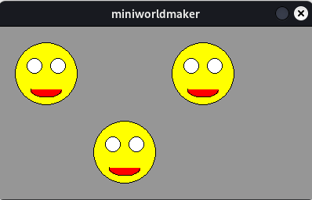

# Functions

So far, you’ve used methods that belong to a `World` or an `Actor`, such as `on_setup` or `act`.

Now you’ll learn how to define your own functions. Functions are *subprograms* that allow you to reuse code instead of writing it over and over.

---

## First Example

Suppose you want to create four red circles as shown in this image:

This can be done like so:

```python
from miniworlds import *

world = World(80, 80)

c1 = Circle((20, 20), 20)
c1.color = (255, 0, 0)
c2 = Circle((60, 20), 20)
c2.color = (255, 0, 0)
c3 = Circle((60, 60), 20)
c3.color = (255, 0, 0)
c4 = Circle((20, 60), 20)
c4.color = (255, 0, 0)

world.run()
```


This works, but if you wanted to change all four circles to green, you’d need to update the color in four places.

Instead, you can move the logic for creating and coloring a circle into a function:

```python
from miniworlds import *

world = World(80, 80)

def create_circle(x, y):
    c = Circle((x, y), 20)
    c.color = (255, 0, 0)

create_circle(20, 20)
create_circle(60, 20)
create_circle(60, 60)
create_circle(20, 60)

world.run()
```

This defines a function `create_circle`:

* The **name** of the function is `create_circle`
* It takes two **parameters**: `x` and `y`, which specify where to place the circle.
* The **body** of the function creates the circle and sets its color.
* The function is called using its **name** and the appropriate **arguments**, e.g., `(20, 20)`.

---

## General Syntax: Defining Functions

When you want to automate something more complex (e.g. creating Actors), you can define your own function:

```python
def function_name(<parameters>):
    <code block>
```

Example:

```python
def create_circle(x, y):
    c = Circle((x, y), 20)
    c.color = (255, 0, 0)
```

Each function consists of:

* The **signature**: the first line that includes the function name and parameters (e.g., `x` and `y`).
* The **body**: a block of indented code that executes when the function is called.

The commands inside the function are executed from top to bottom when the function is invoked.

---

## Calling Functions

To call a function, use its name followed by parentheses and pass the required arguments:

```python
create_actor(4, 2)
```

This would create an actor at `x=4`, `y=2`.

---

## Drawing Complex Shapes

Functions can help you draw more complex shapes:

```python
from miniworlds import *

world = World(400, 220)

def create_face(x, y):
    c = Circle((x, y), 40)
    c.color = (255, 255, 0)
    c = Circle((x + 15, y - 10), 10)
    c = Circle((x - 15, y - 10), 10)
    a = Arc((x, y + 20), 40, 20, 180, 360)
    a.center = a.position
    a.color = (255, 0, 0)

create_face(60, 60)
create_face(260, 60)
create_face(160, 160)

world.run()
```

This defines a `create_face` function that draws a smiley face, which can be used at various positions.



---

## Assigning Properties and Registering Methods

The following program creates “raindrops” automatically.

Inside the `raindrop` function, each drop is configured and assigned behavior using registered methods:

```python
from miniworlds import *
import random

world = World()
world.add_background((80, 180, 255))

def raindrop(x, y):
    c = Circle((x, y), random.randint(10, 20))
    speed = random.randint(1, 5)
    c.color = (0, 0, random.randint(100, 255), 100)
    c.static = True

    @c.register
    def act(self):
        self.move_down(random.randint(1, 3))

    @c.register
    def on_not_detecting_world(self):
        self.remove()

@world.register
def act(self):
    if world.frame % 5 == 0:
        raindrop(random.randint(0, 400), 0)

world.run()
```

<video controls loop width=450px>
  <source src="../_static/raindrops.webm" type="video/webm">
  Your browser does not support the video tag.
</video>