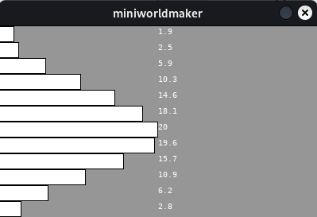

# Lists

Often, you want to access many similar elements at the same time, for example: months.

Suppose you want to store the average monthly temperatures in a city and you have collected the following data:

```python
jan = 1.9
feb = 2.5
mar = 5.9
apr = 10.3
may = 14.6
jun = 18.1
jul = 20
aug = 19.6
sep = 15.7
oct = 10.9
nov = 6.2
dec = 2.8
```

If the data is to be processed further, this becomes impractical, as you'd need to handle each value individually. Lists are used instead.

Lists group similar elements under a common **name** and access them using an **index**.

## What are Lists?

Lists are a collection of data where each item is identified by an index. The individual values are called *elements*.

### Creating Lists

You can create lists in Python using square brackets:

```python
l = [1, 2, 3]
l = ["mini", "worlds"]
```

Lists can contain different data types, so this is also valid:

```python
l = ["hi", 1, 2, [3, 4]]
```

### Length of a List

The length of a list can be calculated with `len()`:

```python
print(len([1, 2, 3]))
print(len(["mini", "worlds"]))
```

### Accessing Elements

You access elements of a list using an index:

```python
variable_name[index]
```

Example:

```python
numbers = [2, 4, 8, 16, 32]
print(numbers[0])
print(numbers[2])
print(numbers[3])
```

### Changing List Elements

You can modify elements by index:

```python
numbers = [2, 4, 8, 16, 32]
numbers[0] = 1
print(numbers)
```

### append()

Python lists are dynamic and can be changed. Use `append()` to add an element:

```python
numbers = [2, 4, 8, 16, 32]
numbers.append(64)
print(numbers)
```

### in

The `in` keyword checks if an element is in a list:

```python
numbers = [2, 4, 8, 16, 32]
print(2 in numbers)
print(3 in numbers)
```

## Example: Months

Instead of using individual variables, we can use a list for the months:

```python
months = []
months.append(1.9)
months.append(2.5)
months.append(5.9)
months.append(10.3)
months.append(14.6)
months.append(18.1)
months.append(20)
months.append(19.6)
months.append(15.7)
months.append(10.9)
months.append(6.2)
months.append(2.8)
```

Or:

```python
months = [1.9, 2.5, 5.9, 10.3, 14.6, 18.1, 20, 19.6, 15.7, 10.9, 6.2, 2.8]
```

```python
print(months)
```

```python
print(months[1], months[4])
```

```python
for month in months:
    sum = sum + month

print(sum / 12)
```

```python
from miniworlds import *

world = World(400, 240)

months = [1.9, 2.5, 5.9, 10.3, 14.6, 18.1, 20, 19.6, 15.7, 10.9, 6.2, 2.8]

i = 0 
for month in months:
    Rectangle((0, i), month * 10, 20)
    n = Number((200, i), month)
    n.font_size = 10
    i = i + 20

world.run()
```



## Storing Graphical Objects

We can also store objects in lists. This is often used for collision detection.

For example, we want to create a program where green circles should be collected and red ones avoided:

```python
from miniworlds import *
import random

world = World(400, 200)
points = Number((0, 0), 0)

red_circles = []
green_circles = []

@world.register
def act(self):
    if self.frame % 100 == 0:
        c = Circle((400, random.randint(0, 200), 40))
        c.color = (255, 0, 0)
        red_circles.append(c)
    elif self.frame % 50 == 0:
        c = Circle((400, random.randint(0, 200), 40))
        c.color = (0, 255, 0)
        green_circles.append(c)
    for circle in red_circles:
        circle.move_left()
    for circle in green_circles:
        circle.move_left()

@world.register
def on_mouse_left(self, mouse_position):
    actors = self.get_actors_at_position(mouse_position)
    for actor in actors:
        if actor in red_circles:
            actor.remove()
            points.set_number(points.get_number() - 1)
        elif actor in green_circles:
            actor.remove()
            points.set_number(points.get_number() + 1)

world.run()
```

<video loop autoplay muted width="400">
<source src="../_static/collecting.webm" type="video/webm">
</video>
