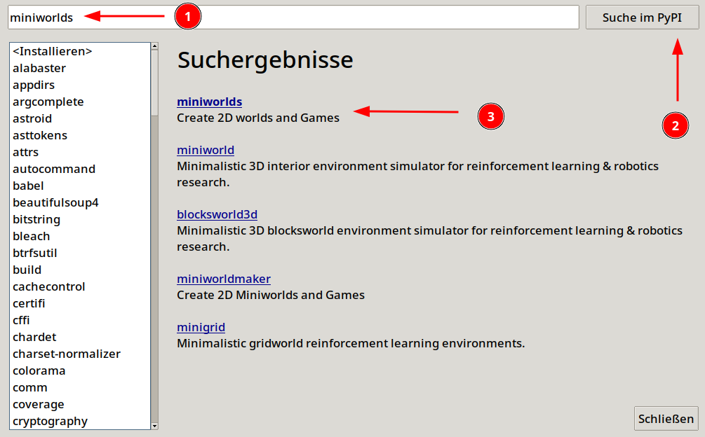

# Installation

Du kannst miniworlds auf deinem Computer oder mit Hilfe von Thonny
installieren:

## Auf deinem Computer

1. Installiere zuerst Python.

   Python kannst du z.B. unter [Python.org](https://www.python.org)
   herunterladen.

   Alternativ kannst du auch die Entwicklungsumgebung
   [Thonny](https://thonny.org/) installieren - Diese bringt Python
   direkt mit.

2. Installiere das Framework mit:

``` python 
pip install miniworlds
```

1. Installiere eine geeignete Entwicklungsumgebung, z.B.:

   - [Thonny](https://thonny.org/)
   - [Pycharm](https://www.jetbrains.com/de-de/pycharm/)

\...jetzt kannst du loslegen.

## Mit Thonny

Klicke zunächst auf \"Extras -\> Verwalte Pakete\". Gib dann im Suchfeld \"miniworlds\" ein und installiere den
miniworlds


