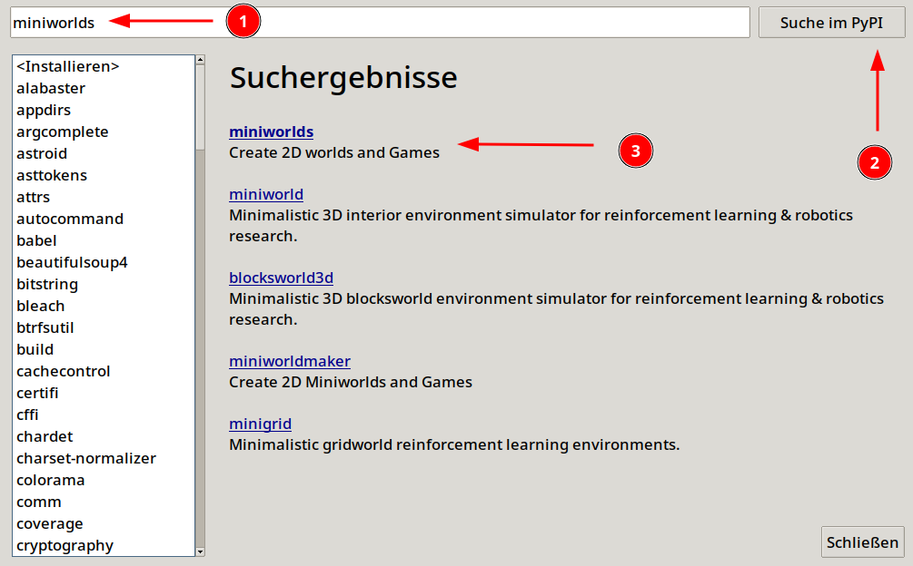

# Installation

You can install **miniworlds** on your computer or using **Thonny**:

## On your computer

1. First, install Python.

   You can download Python from [Python.org](https://www.python.org).

   Alternatively, you can install the development environment
   [Thonny](https://thonny.org/) – it comes with Python included.

2. Install the framework with:

```bash
pip install miniworlds
```

3. Install a suitable development environment, for example:

   * [Thonny](https://thonny.org/)
   * [Pycharm](https://www.jetbrains.com/pycharm/)

…now you’re ready to get started!

## Optional Physics Package

The regular `miniworlds` package contains the core 2D engine. Physics support is
provided by a separate package so that the base installation stays small and
works reliably in school environments.

Install physics support only when you need gravity, bouncing, joints, or
collision simulation:

```bash
pip install miniworlds miniworlds_physics
```

Then import the physics world from the separate package:

```python
from miniworlds import Circle
from miniworlds_physics import PhysicsWorld
```

See [World > PhysicsWorld](../api/world_physics.md) for the API and a first
example.

## Python And Runtime Notes

Miniworlds runs with Python and pygame-ce. Use a current Python 3 installation
when possible.

Some learning environments run Python in the browser, for example Pyodide or
H5P-based tasks. These environments are useful for tutorials and small examples,
but they may not support every desktop feature. In particular, physics support
depends on the separate `miniworlds_physics` package and may be limited or
unavailable in browser runtimes.

## With Thonny

First click on **"Tools → Manage Packages"**. Then enter `"miniworlds"` in the search field and install **miniworlds**.

If you want to use physics examples in Thonny, also install
`miniworlds_physics` in the same package manager.


