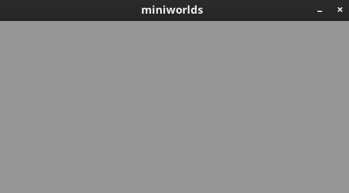
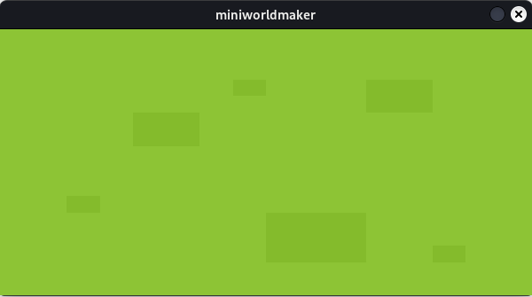

# Die erste Welt

In diesem Abschnitt werden wir unsere erste "Welt" in Miniworlds erstellen. Eine Welt ist der Grundbaustein für alles, 
was du in deiner Anwendung sehen oder steuern möchtest – von einem simplen Spielfeld bis hin zu komplexeren Welten 
wie in Videospielen. Lass uns direkt loslegen:

## Erste Schritte

Um eine Welt zu erstellen, brauchst du nur ein paar Zeilen Code:

```python
from miniworlds import World

# Erstellen einer neuen Welt mit den Maßen 600x300 Pixel
world = World(600, 300)

# Starte die Welt, um sie anzuzeigen
world.run()
```

### Was passiert in diesem Code?

* Bibliothek importieren: In der ersten Zeile importierst du die miniworlds-Bibliothek, die alle benötigten Funktionen bereitstellt.
* Welt erstellen: Die Methode miniworlds.World(600, 300) erstellt eine neue Welt. 
  Hiermit legst du die Größe der Welt fest: Sie ist 600 Pixel breit und 300 Pixel hoch.
* Welt starten: world.run() startet die Welt und zeigt sie auf dem Bildschirm an. 
  Stell dir diese Zeile wie den "Play"-Button vor – erst danach wird deine Welt sichtbar.

Schau dir das folgende Bild an, das den ersten Schritt zeigt:



## Hintergrund hinzufügen

Damit die Welt nicht leer aussieht, kannst du ihr ein Bild als Hintergrund hinzufügen. 
Dazu brauchst du ein Bild, das du im images-Ordner deines Projekts speicherst. 
Die Ordnerstruktur deines Projekts könnte folgendermaßen aussehen:

```
project/
├── my_world.py  # file with your python code
└── images/
    └── grass.png
```

Nachdem du dein Bild (z.B. grass.png) in den Ordner images gelegt hast, 
kannst du es mit der Methode add_background der Welt hinzufügen:

```python
import miniworlds

# Welt erstellen
world = miniworlds.World(600, 300)

# Bild als Hintergrund hinzufügen
world.add_background("images/grass.png")

# Welt starten
world.run()
```


### Was passiert hier?

* Die Methode add_background("images/grass.png") lädt das Bild grass.png aus dem angegebenen Pfad und 
  setzt es als Hintergrund für deine Welt.


:::{note}

Es gibt verschiedene Arten von `Worlds` in miniworlds. 
Die `TiledWorld` ist speziell für Spiele auf gekachelten Flächen gedacht, z.B. Top-Down RPGs.
:::

:::{seealso}
[Konzept: Naming und Variablen](../concepts/concept_naming)
:::

:::{seealso}
[Konzept: Importe](../concepts/concept_imports)
:::
