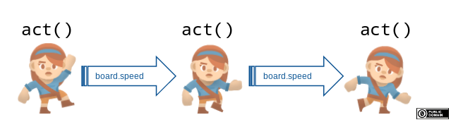

# Act

So far, you’ve learned how to create worlds and place actors in them.
Now it’s time to bring things to life:

## The `act()` Method

The `act()` method controls the behavior of your world and all its actors.
It is called once every frame (i.e., every `world.step` time unit), continuing until the program ends.



### Example: Moving Actor

When you create an `Actor`, you can define its `act()` method and register it using the `@register` decorator:

```python
from miniworlds import World, Actor

world = World(500, 500)
world.add_background("images/sky.jpg")

player = Actor((90, 90))
player.add_costume("images/ship.png")

@player.register  # Registers the act method. This is required for it to be called regularly.
def act(self):
    self.y = self.y - 1  # Moves the actor upward along the y-axis

world.run()
```

#### Explanation

* The `act()` method moves the `player` up by one unit on every frame.
* New here is the use of `self`, which lets the object refer to itself.
  So the line `self.y = self.y - 1` means the `player` object is reducing its own y-coordinate by 1.

\:::{seealso}
For more on methods and how to use `self`, see [here](concepts/concept_self.md).
\:::
