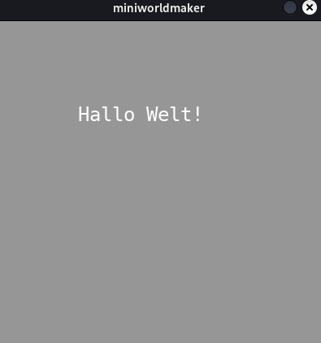
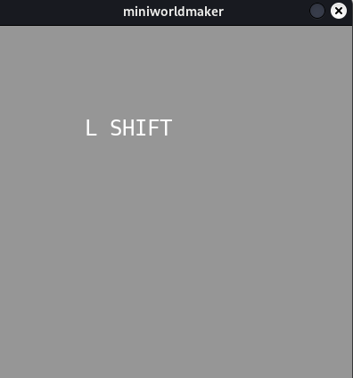

# Text und Zahlen

## Punktestand/Spielstatus

In vielen Spielen möchtest du den aktuellen Punktestand oder andere Statusanzeigen einblenden. 

**Miniworlds** bietet dafür spezielle Actors wie **Text**- oder **Number**-Actors, die dir helfen, Informationen anzuzeigen.

### Text erstellen

Um einen Text anzuzeigen, kannst du folgendermaßen vorgehen:

```python
text = miniworlds.Text(position, string)
```

- `position`: Ein Tupel, das die obere linke Ecke des Textes definiert.
- `string`: Der anzuzeigende Text.

:::{note}
In einer normalen **World** wird der Text automatisch skaliert. 
In einer **Tiledworld** wird der Text in einer Kachel angezeigt, was bei längeren Texten zu Platzproblemen führen kann.
:::

#### Beispiel:

```python
import miniworlds 

world = miniworlds.World(400, 400)
hallo_welt = Text((100, 100), "Hallo Welt!")

world.run()
```



---

### Text ändern

Du kannst den angezeigten Text jederzeit mit dem Attribut `text` anpassen.

Das folgende Beispiel zeigt den zuletzt gedrückten Tastendruck an:

```python
from miniworlds import World, Text

world = World(400, 400)
key_display = Text((100, 100), "")

@key_display.register
def on_key_down(self, key):
    print(key)
    self.text = key[0]  # Zeigt den ersten Buchstaben des gedrückten Keys an

world.run()
```



---

## Zahlen anzeigen

Um Zahlen auf dem Bildschirm anzuzeigen, kannst du **Number-Actors** verwenden. Die Funktionsweise ähnelt der von Text-Actors. Im folgenden Beispiel wird die angezeigte Zahl bei jedem Tastendruck um 1 erhöht:

```python
from miniworlds import World, Number

world = World(400, 400)
show_number = Number((100, 100), 1)

@show_number.register
def on_key_down(self, key):
    n = self.get_number()
    self.set_number(n + 1)

world.run()
```

---

